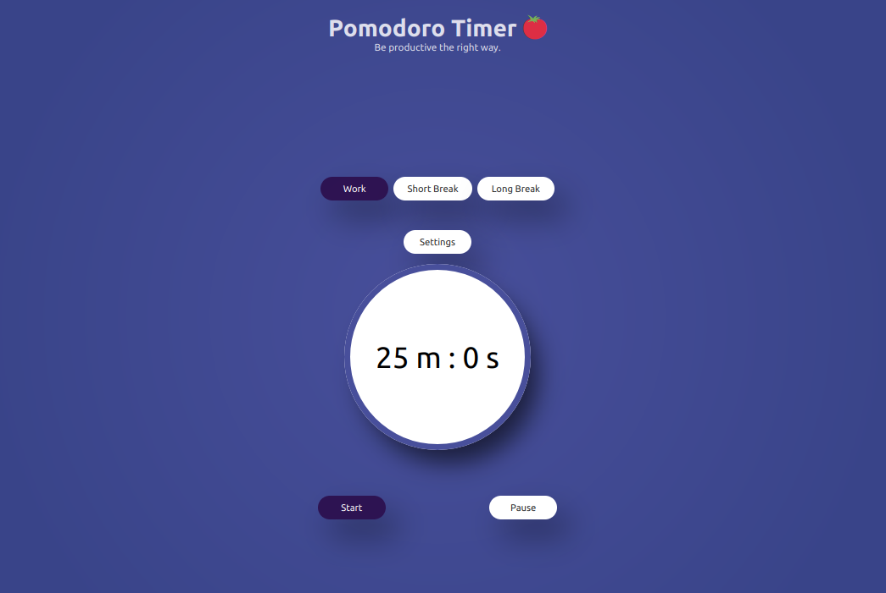
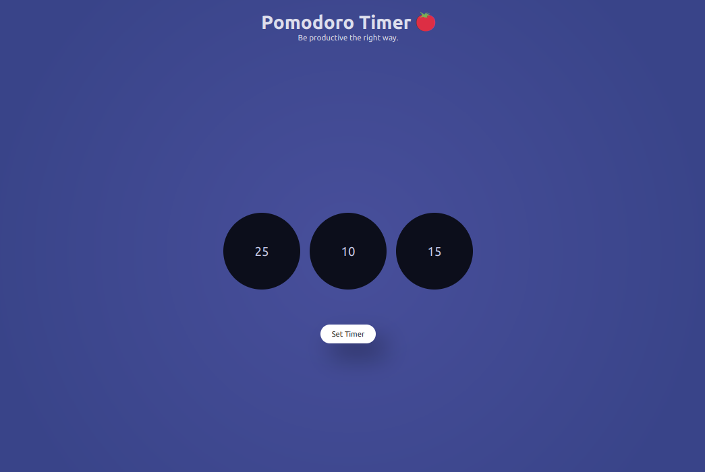

<h1> Pomodoro Timer 🍅 </h1>

Live [Demo](https://pomodoro-timer-app.vercel.app/)

**Boost productivity with the Pomodoro Timer - a simple and effective technique that uses focused work sessions to achieve more in less time.**

The Pomodoro Technique is a time-management method developed by Francesco Cirillo in the late 1980s. It involves breaking work into focused intervals, typically 25 minutes in length, called "pomodoros," separated by short breaks of 3-5 minutes. After completing four pomodoros, a longer break of 15-30 minutes is taken. The technique aims to improve productivity and focus by reducing the impact of interruptions, distractions, and fatigue.

 

## Features

- Set timer under different category :
  - Work Time
  - Short Break 
  - Long Break
- Easy to use.

## Getting Started

To get started with the Pomodoro Timer App, follow these steps:

1. Clone the repository to your local machine using **git clone** `https://github.com/lonebots/pomodoro-timer-app`.
2. Install the necessary dependencies using `yarn install`.
3. Run the app using `yarn start`.
4. Customize the timer and task management settings to suit your preferences.

## Contributing

We welcome contributions from the open-source community to help improve the Pomodoro Timer App. To contribute, follow these steps:

1. Fork the repository to your GitHub account.
2. Make your changes on a new branch.
3. Test your changes to ensure they work as expected.
4. Submit a pull request to the main repository.

